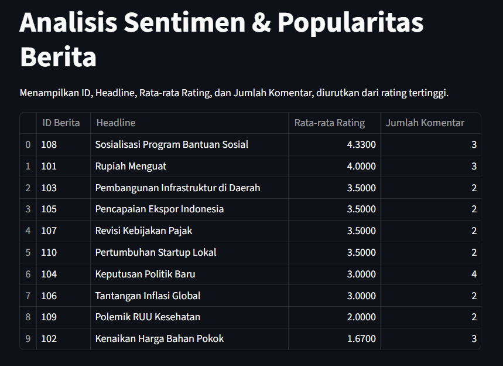

# Analisa Sentimen Netizen Pada Sebuah Berita dan Popularitas Berita dalam Satu Hari

## Latar Belakang

Sebuah lembaga riset politik ingin mendapatkan gambaran yang lebih mendalam mengenai narasi berita dan respons publik terhadapnya. Mereka memiliki dua set data:

1. Data Berita: Berisi judul dan isi artikel berita.

2. Data Komentar: Berisi komentar-komentar dan rating bintang yang diberikan oleh pembaca terhadap artikel berita.

**Tugas Anda** adalah membuat program yang dapat memproses kedua file tersebut dan mengurutkan headline Berita dengan rating bintang tertinggi dan terpopuler berdasarkan kunjungan netizen dalam satu hari ini.

## Deskripsi Soal

Fokus dari bagian ini adalah mengidentifikasi topik melalui kata-kata yang paling sering muncul di berbagai artikel.

- Pemuatan Data Berita: Baca seluruh data dari `news_data.csv` dan `comment_news.csv`. Simpan data-data tersebut ke dalam dictionary terpisah.

- Pra-pemrosesan Berita: Lakukan langkah-langkah berikut:

  1. Cocokan data dari `comment_news.csv` dengan `news_data.csv` menggunakan `idBerita`.

  2. Hitung jumlah komentar untuk setiap berita (untuk menghitung berapa banyak kunjungan).

  3. Hitung rata-rata rating bintang setiap berita `(rating maksimal 5)`.

- Penyajian Hasil: Tampilkan semua data berita dalam satu tabel (berisikan kolom judul berita, rata-rata rating bintang, dan jumlah komentar) dan urutkan berita dengan rating bintang yang tertinggi.

## Struktur Data File

Ada dua file CSV yang akan Anda gunakan:

1. `news_data.csv`

   - Berisi data berita.

   - Kolom: `idBerita`, `Headline`, `Content`.

   - idBerita berfungsi sebagai Primary Key.

2. `comment_news.csv`

   - Berisi data komentar.

   - Kolom: `idKomentar`, `idBerita`, `Komentar`, `Rating`.

   - `idBerita` di sini berfungsi sebagai Foreign Key, yang menghubungkan setiap komentar ke berita yang relevan.

## Catatan

1. File `comment_news.csv`, dan `news_data.csv` sudah disediakan, tidak usah membuat lagi.

2. **Kerjakan mandiri dan jangan bertanya kepada teman lainnya**

3. Plagiasi akan di kurangi nilainya

4. Output harus sesuai dengan ketentuan soal (Berbasis UI Streamlit)

5. Gunakan tipe data `dictionary` untuk menyimpan data secara temporary

6. Usahakan menggunakan fungsi untuk penyelesaian soal

7. Tidak perlu menggunakan file input di streamlit

## Output Hasil

## Penilaian

1. Kemampuan Membuat Fungsi (35%)

2. Output sesuai dengan ketentuan soal (30%)

3. Menggunakan Streamlit (15%)

4. Kesesuaian UI dengan contoh di soal (20%)
